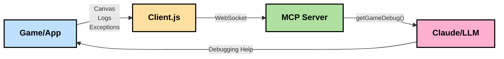

# CLAUDE.md - Vibe-Eyes Project Guide

Vibe-Eyes focuses on providing visual context and debug information to LLMs during vibe coding sessions.


Vibe-Eyes uses a client-server architecture where a lightweight browser client captures canvas content and debug information, sends it to a Node.js server via WebSockets, which then vectorizes the images into compact SVG representations and makes them available to LLMs through the Model Context Protocol (MCP).

## Project Overview

Vibe-Eyes is an MCP server that gives LLMs (like yourself) an approximation of canvas output and debug information from browser games and applications. It enables more effective "vibe coding" sessions by letting you see what's happening in the application.



### Project Structure

- `vectorizer.js` - Core SVG vectorization library
- `mcp.js` - MCP server that receives canvas captures and exposes them to LLMs
- Browser client - Available at [vibe-eyes-client repository](https://github.com/monteslu/vibe-eyes-client) for capturing canvas and console output
- `cli.js` - Standalone CLI tool for vectorization (not central to main functionality)

## Key Commands

- Install: `npm install`
- Start MCP server: `npm run server` (or `node mcp.js`)
- Use vectorizer CLI: `vibe-eyes-vectorize input.png output.svg`

## MCP Tool Usage

Vibe-Eyes provides a single, powerful MCP tool called `getGameDebug` that gives you visual and debug insight into what's happening in the user's browser:

```javascript
getGameDebug({
  includeSvg: true/false  // Whether to include SVG visualization
})
```

This tool acts as your "eyes" during vibe coding sessions by:

1. **Providing Visual Context**: Shows you what's currently on the user's game/app canvas
2. **Capturing Debug Information**: Collects recent console.log and console.error entries
3. **Catching Unhandled Exceptions**: Records any syntax errors or uncaught exceptions with stack traces
4. **Correlating Visual and Code State**: Timestamps help you connect logs to visual state
5. **Optimizing for MCP**: Converts pixel-based canvas to compact SVG representation

When to use `includeSvg`:
- Set to `true` when you need to understand the visual state (e.g., "What does the game look like right now?")
- Set to `false` when you only need log information (for better performance)

Example response structure:
```javascript
{
  success: true,
  content: [
    {
      type: "text",
      text: "Game State: capture_123456789 (2021-03-19T12:00:16.161Z)\n\nConsole Logs:\n[2021-03-19T12:00:16.000Z] Player position: [object Object]\n...\n\nNo errors.\n\nVectorization Stats:\n{\n  \"vectorizeTime\": 30.96,\n  \"optimizeTime\": 9.88,\n  \"originalSize\": 34275,\n  \"finalSize\": 3502,\n  \"sizeReduction\": 89.78\n}"
    },
    {
      type: "image",
      data: "data:image/svg+xml;base64,...", // Base64 encoded SVG
      mimeType: "image/svg+xml"
    }
  ]
}
```

This tool bridges the gap between what the user sees and what you can understand about their application state.

## Understanding Vectorized Canvas

IMPORTANT: The SVG representation you'll receive is only a ROUGH APPROXIMATION of the actual canvas content, not a pixel-perfect reproduction. Key characteristics:

- Vector paths instead of pixel data
- Heavily simplified color palette
- Approximated shapes that capture the essence but not exact details
- Prioritization of larger visual elements over small details
- Significantly reduced data size compared to screenshots

Think of it like a sketch rather than a photograph - it conveys the general visual state and layout but will omit or simplify many details. This approximation is intentional, designed to give you enough visual context to understand what's happening without requiring excessive data transmission.

When analyzing the vectorized output, focus on:
- General layout and positioning of elements
- Relative sizes and relationships
- Presence/absence of major visual components
- Color regions and boundaries

Do not rely on precise pixel measurements, exact color values, or fine details that may be lost in the vectorization process.

## Debug Workflow Tips

When a user is using Vibe-Eyes:

1. Check for unhandled exceptions first - these often reveal syntax errors or critical issues
2. Focus on the console logs and errors to understand the application state
3. Request the SVG representation (includeSvg: true) when you need visual context
4. Correlate visual elements with the logs to identify issues
5. Use stack traces from exceptions to identify exactly where errors occur
6. Remember that the visual is an approximation - small details may be simplified
7. Use the timestamps to understand the sequence of events

## Performance Notes

- Canvas captures and vectorization can be resource-intensive
- The client captures at configurable intervals (not every frame)
- WebSocket transport avoids CORS issues with cross-domain setups
- The server processes images sequentially to prevent overload
- The server keeps only the latest capture in memory

## Code Style Guidelines

- ES Modules syntax (import/export)
- File names: lowercase with .js extension
- Variables/functions: camelCase
- Tab size: 2 spaces
- Node.js shebang: `#!/usr/bin/env node`
- Import statements at the top, grouped logically
- JSDoc style comments for functions and classes

## Dependencies

- `@neplex/vectorizer` - Core vectorization engine
- `express` - HTTP server
- `socket.io` - WebSocket server
- `svgo` - SVG optimization
- `@modelcontextprotocol/sdk` - MCP integration
- `zod` - Schema validation for MCP

Vibe-Eyes allows you to "see" browser applications during coding sessions, reducing the need for users to manually share screenshots and enabling more effective debugging.