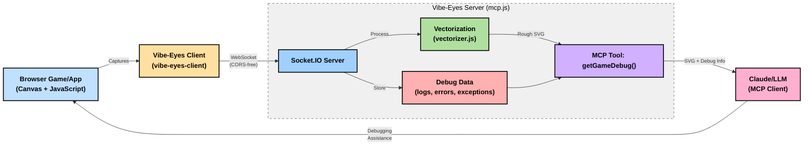

# Vibe-Eyes

An MCP server that enables LLMs to "see" what's happening in browser-based games and applications through vectorized canvas visualization and debug information.


Vibe-Eyes uses a client-server architecture where a lightweight browser client captures canvas content and debug information, sends it to a Node.js server via WebSockets, which then vectorizes the images into compact SVG representations and makes them available to LLMs through the Model Context Protocol (MCP).



> Note: This project is experimental and designed to enhance "vibe coding" sessions with LLMs by providing visual context and rich debug information.

## Video Explanation
[](https://www.youtube.com/watch?v=z2on3KelaH4)


## Key Capabilities

- Captures and vectorizes canvas elements from browser games
- Collects console logs and errors in real-time
- Catches unhandled exceptions with full stack traces
- Makes the visual and debug information available to LLMs via MCP
- Creates a seamless debugging experience for developers working with LLMs

## How It Works

1. A lightweight client runs in the browser game/application
2. The client captures canvas snapshots, console logs/errors, and unhandled exceptions
3. Data is sent to the Vibe-Eyes server via WebSocket (avoiding CORS issues)
4. The server vectorizes the canvas images and stores them with the debug information
5. LLMs connect via the Model Context Protocol to access the latest data
6. LLMs can "see" what's happening and help debug issues with full context
## Components

### 1. Vibe-Eyes MCP Server (`mcp.js`)

The core server that:
- Receives canvas snapshots via Socket.IO
- Vectorizes images to compact SVG representation (rough approximation)
- Stores debug information (logs, errors, exceptions, timing)
- Exposes the data via Model Context Protocol (MCP)
- Provides HTTP endpoints for direct access
- Processes images sequentially to manage resources

### 2. Browser Client

The browser client is available at [vibe-eyes-client repository](https://github.com/monteslu/vibe-eyes-client).

A lightweight browser integration that:
- Finds canvas elements in the page
- Captures canvas content as data URLs
- Intercepts console logs and errors
- Catches global unhandled exceptions with stack traces
- Sends data to the Vibe-Eyes server via WebSockets
- Minimizes performance impact on games
- Supports explicit initialization to control when capturing starts

### 3. Vectorization Engine (`vectorizer.js`)

A high-quality SVG vectorization library that:
- Converts raster images to vector SVGs
- Optimizes SVGs for size and clarity
- Preserves visual information while reducing data size

## Getting Started

### Installation

```bash
# Clone the repository
git clone https://github.com/monteslu/vibe-eyes.git
cd vibe-eyes

# Install dependencies
npm install
```

### Using with LLM Agents

Register the MCP server with your AI agent:

```bash
# For Claude Code
claude mcp add
```

This enables Claude to use the Vibe-Eyes capabilities via MCP.

### Integrating with Games/Applications

Add the client to your browser application by including the required scripts:

```html
<!-- Include Socket.IO client -->
<script src="https://cdn.socket.io/4.7.4/socket.io.min.js"></script>

<!-- Include Vibe-Eyes client -->
<script src="https://cdn.jsdelivr.net/npm/vibe-eyes-client/dist/index.min.js"></script>

<!-- Initialize the client -->
<script>
  // Import the initialization function if using as module
  // import { initializeVibeEyes } from 'vibe-eyes-client';
  
  // Initialize with configuration
  const vibeEyes = initializeVibeEyes({
    // WebSocket URL to the Vibe-Eyes server
    serverUrl: 'ws://localhost:8869',
    // Capture interval in milliseconds
    captureDelay: 1000,
    // Start capturing automatically after connection
    autoCapture: true
  });
</script>
```

### Using with Claude or Other LLMs

The MCP server exposes a tool for LLMs to access the latest visual and debug information via Model Context Protocol (MCP):

```
getGameDebug({ includeSvg: true/false })
```

The LLM will receive:
- Recent console logs and errors from the application
- Unhandled exceptions with full stack traces (if any occurred)
- Vectorized SVG approximation of the canvas (if `includeSvg` is true)
- Timing and correlation information to connect visual state with logs

This allows the LLM to "see" what's happening in the application and provide better assistance.

#### Example MCP Config (for Claude Code)

To access Vibe-Eyes from Claude:

```json
{
  "name": "vibe-eyes",
  "url": "http://localhost:8869",
  "tools": [
    {
      "name": "getGameDebug",
      "description": "Retrieves the most recent canvas visualization and debug information from a browser game or application"
    }
  ]
}
```

## How Vibe-Eyes Helps with "Vibe Coding"

Traditional "vibe coding" sessions require developers to manually take screenshots and describe what's happening in their application. Vibe-Eyes automates this process by:

1. **Providing Visual Context**: LLMs can see the actual visual state of the game/app
2. **Correlating Visual and Code Issues**: Console logs are paired with visual state
3. **Reducing Manual Work**: No need to manually capture and upload screenshots
4. **Enabling Real-Time Debugging**: LLMs can observe changes as they happen
5. **Optimizing Data Transfer**: Vector representation is more compact than screenshots

## Performance Considerations

- The browser client is designed to minimize impact on application performance
- Creating canvas data URLs can be CPU-intensive, so capturing frequency is configurable
- WebSocket transport avoids CORS issues common in cross-domain setups
- The server processes images sequentially to prevent overload
- SVG vectorization balances visual accuracy with size optimization

## Direct SVG Access

For applications that want to reuse the vectorized SVG output:

1. **WebSocket Response**: The server includes the SVG directly in WebSocket responses:
   ```javascript
   socket.on('debugCapture', (data, callback) => {
     // Capture and process...
     callback({
       success: true,
       id: "capture_123",
       svg: "<svg>...</svg>",  // Vectorized SVG 
       stats: { /* stats data */ }
     });
   });
   ```

2. **HTTP Endpoint**: Access the latest capture via the `/latest` endpoint:
   ```javascript
   fetch('http://localhost:8869/latest')
     .then(res => res.json())
     .then(data => {
       const svg = data.vectorized?.svg;
       // Use the SVG...
     });
   ```

## API Reference

### Browser Client

```javascript
// Initialize the client
const vibeEyes = initializeVibeEyes({
  serverUrl: 'ws://localhost:8869',
  captureDelay: 1000, // ms between captures
  maxLogs: 10,        // Max console.log entries to store
  maxErrors: 10,      // Max console.error entries to store
  autoCapture: true   // Start capturing automatically
});

// Manual control
vibeEyes.startCaptureLoop(); // Start auto-capturing
vibeEyes.stopCaptureLoop();  // Stop auto-capturing
vibeEyes.captureAndSend();   // Trigger one capture immediately

// The server responds with:
// {
//   success: true,
//   id: "capture_1234567890",
//   processedAt: 1616161616161,
//   svg: "<svg>...</svg>",  // The vectorized SVG for direct use
//   stats: {
//     vectorizeTime: 120,
//     optimizeTime: 30,
//     originalSize: 50000,
//     finalSize: 15000,
//     sizeReduction: 70
//   }
// }
```

### MCP Tool

```javascript
// MCP tool available to LLMs
getGameDebug({
  includeSvg: true  // Whether to include SVG visualization
})

// Returns
{
  success: true,
  capture: {
    id: "capture_123456789",
    timestamp: 1616161616161,
    console_logs: [
      { timestamp: 1616161616000, data: ["Player position:", {x: 10, y: 20}] },
      // ...more logs
    ],
    console_errors: [
      // Any errors captured
    ],
    unhandled_exception: {
      timestamp: 1616161616100,
      message: "Uncaught SyntaxError: Unexpected token ';'",
      stack: "SyntaxError: Unexpected token ';'\n    at game.js:42:10\n...",
      type: "SyntaxError",
      source: "game.js",
      line: 42,
      column: 10
    },
    vectorized: {
      svg: "<svg>...</svg>",  // Only if includeSvg is true (rough approximation)
      imageType: "png",
      stats: {
        vectorizeTime: 120,
        optimizeTime: 30,
        originalSize: 50000,
        finalSize: 15000,
        sizeReduction: 70
      }
    }
  }
}
```

## Standalone Vectorizer CLI

The project also includes a standalone CLI tool for vectorizing individual files:

```bash
# Install CLI globally
npm install -g vibe-eyes

# Use the CLI
vibe-eyes-vectorize input.png output.svg

# With options
vibe-eyes-vectorize photo.jpg --color-precision 10 --max-iterations 100
```

## License

ISC